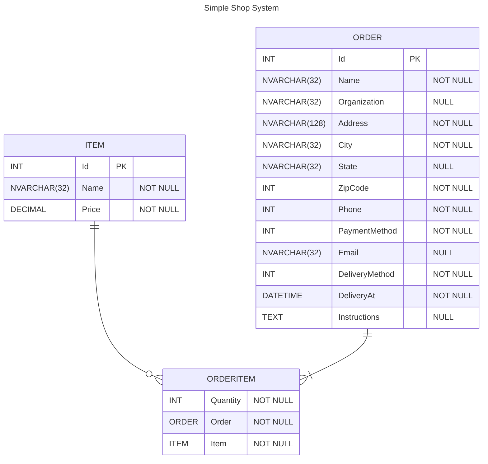

# simple-shop
Project creating the simple shop from the database-modelling website.

## Datamodel

```mermaid
---
title: Simple Shop System
---
erDiagram
ORDER {
    INT Id PK
    NVARCHAR(32) Name "NOT NULL"
    NVARCHAR(32) Organization "NULL"
    NVARCHAR(128) Address "NOT NULL"
    NVARCHAR(32) City "NOT NULL"
    NVARCHAR(32) State "NULL"
    INT ZipCode "NOT NULL"
    INT Phone "NOT NULL"
    INT PaymentMethod "NOT NULL"
    NVARCHAR(32) Email "NULL"
    INT DeliveryMethod "NOT NULL"
    DATETIME DeliveryAt "NOT NULL"
    TEXT Instructions "NULL"
}

ORDERITEM {
    INT Quantity "NOT NULL"
    ORDER Order "NOT NULL"
    ITEM Item "NOT NULL"
}

ITEM {
    INT Id PK
    NVARCHAR(32) Name "NOT NULL"
    DECIMAL Price "NOT NULL"
}

ITEM ||--o{ ORDERITEM : ""
ORDER ||--|{ ORDERITEM : ""
```
