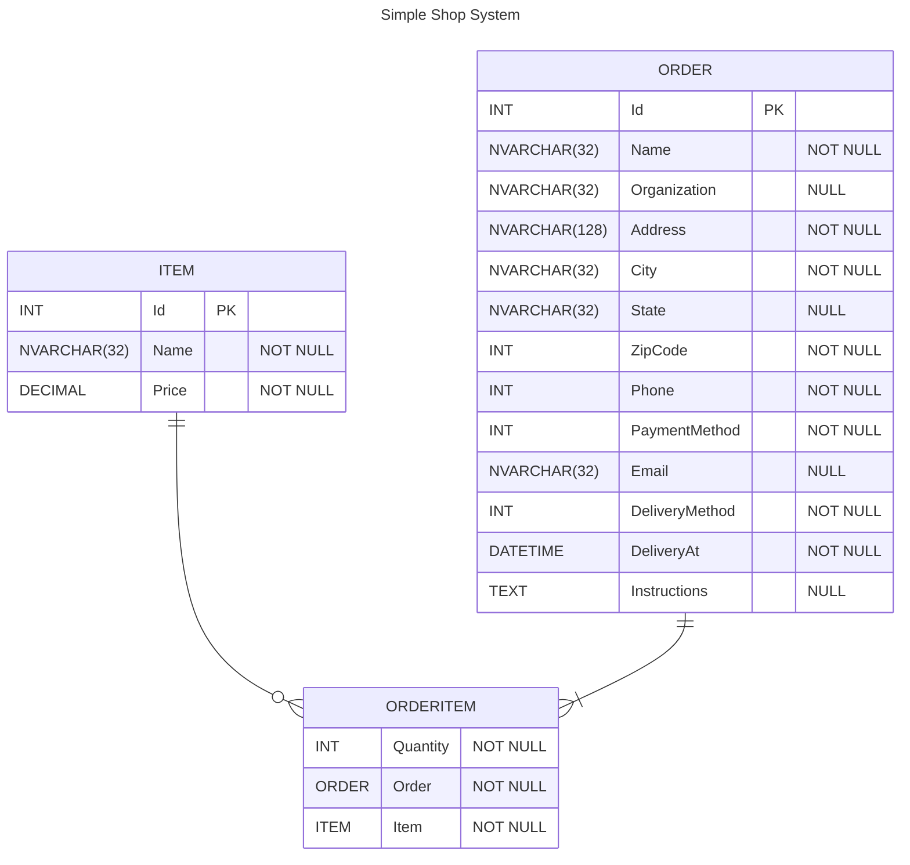

# simple-shop
Project creating the simple shop from the database-modelling [website](https://database-modelling.com/exercise/simple-shop-system).
The model has been implemented using a DDD approach with EF Core as ORM framework.
The project is implemented as a Minimal API, to support simple CRUD operations.

## DDD

Entity, Aggregate Root and ValueObject.
Repository pattern (Generic or Per AggregateRoot).
UnitOfWork (Transactions).
Readonly lists in entities.
Private setters in entities.
DomainEvents (Executed in transaction or executed asynchronously)

## Datamodel

